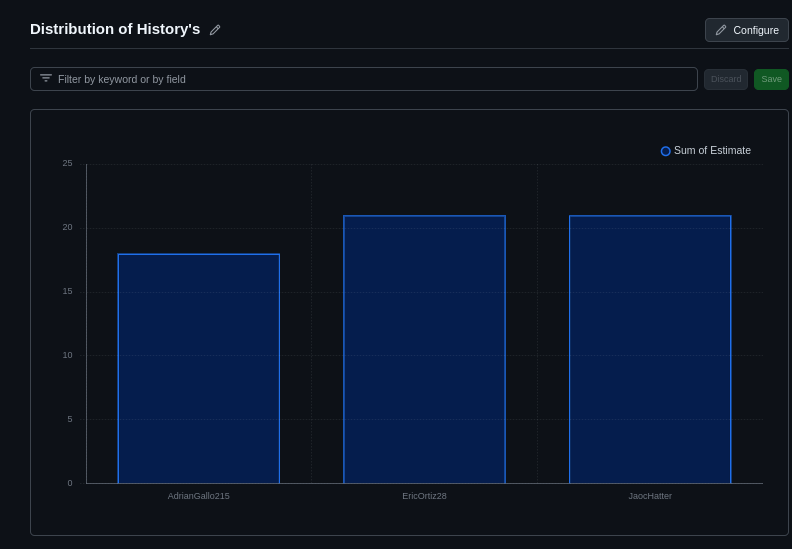

# Juego de batalla naval
# Examen parcial CC3S2

**Ramas Individuales y desarrollo colaborativo**

>Se decidió crear ramas para cada integrante diferenciandose por : (feature/<nombre>) dependiendo de quien es el que esta usando dicha rama.

>Utilizamos develop para integrar las funcionalidades antes de fusionarlas a main o master.

**Kanban , Backlog de Producto y Asignación de tareas justa**

## **Sprint 1:**

>Asignaremos 3 historias del Backlog como parte de nuestro primer Sprint en donde Adrian se encargara del Desarrollo del sistema de ataques y deteccion de impactos, Jared de la implementación de la colocación de barcos y gestión del tablero y Eric se encargara de la gestión de puntuaciones y seguimiento de barcos hundidos.

>Luego pasamos a progresar en nuestras historias de usuario respectivas a este sprint reflejandose al estar en la columna in progress.

>Algunas historias que estaban en la columna in progress pasaron a in review para ser analizadas por todo el equipo mientras qeu otras aun se encontraban en in progress. 

>se completo una de las revisiones de las historias y paso a la columna Done,  mientras que una historia paso de in progress a in review.

>Se revisaron las historias restantes que estaban en in review y se aceptaron para pasara a la columna Done.

## **Sprint 2:**

>En este sprint se asignaron las tareas de Desarrollo de Pruebas Automatizadas con Behave a Jared, conexión con la base de datos prometheus a eric y interfaz de monitoreo en tiempo real usando grafana a Adrian.

>Se empezo a trabajar en las historias que se encuantra en la columna in progress.

>La historia de conexion con la base de datos de prometheus paso a la columna in review para ser revisada por el equipo.

>La historia que estaba en la columna in review paso a done y todas las historias que se encontraban en in progres pasaron a la columna in review.

>Se completo la revision de las historias restantes y pasaron a la columna Done.

## **Sprint 3:**

>Para este sprint se asigno la tarea de configurar CI/CD Pipeline para github actions a Eric, Configuracion de Docker compose a Jared , crear y ejecutar pruebas unitarias a jared y la clausura del sprint y preparacion de la documentación final a todos los alumnos.

>Tres de las cuatro historias pasaron a la columna in progress.

>Dos historias pasaron de la columna in progress a in review.

>Una historia paso de la columna backlog a la columna in progress , las que se encontraban en la columna in review pasaron a la columna a Done y la ultima historia encontrada en la columna in progress a pasado a in review.

>Todas las historias pasaron de la columna in review a la columna done y las que se encontraban en la columna in progress ahora se encuantra en la columna in review.

>La historia faltante en la columna in review fue revisada por el equipo y paso a la columna done.

**Configuración del burndown chart:**

>En este gráfico se muestra cual fue la contribución de cada estudiante en el primer sprint de forma general.

>En este gráfico se muestra cual fue la contribución de cada estudiante en el primer sprint, especificamente en la columna done.

>En este gráfico se puede visualizar el progreso de cada estudicante en el segundo sprint.

>En este gráfico se puede visualizar el progreso de cada estudicante en el Tercer sprint.

**GitHub actions y CI/CD**

>Se a implementado un flujo para verificar la auditoria de las dependencias pero se agregaran las diferentes test que se avanzaran en un futuro.
