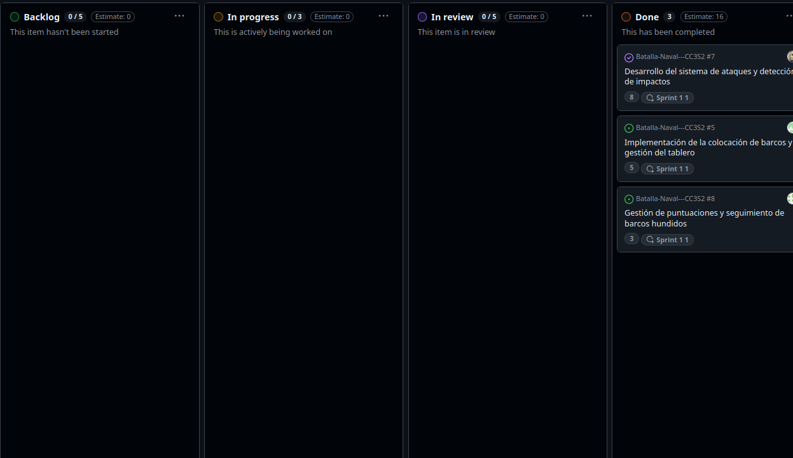
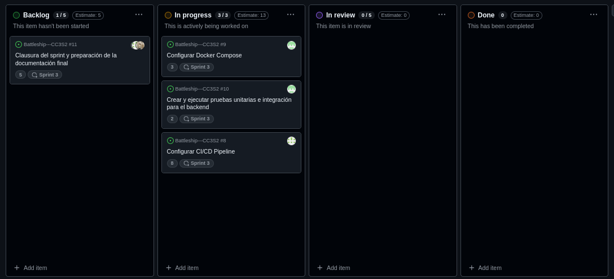
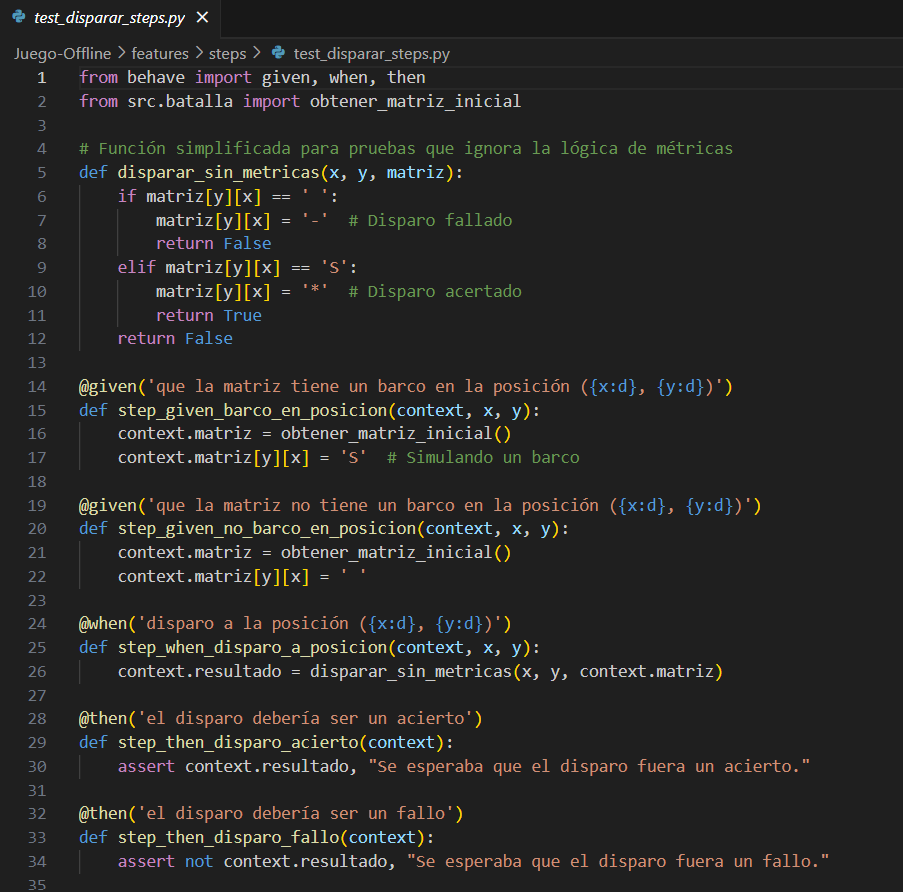
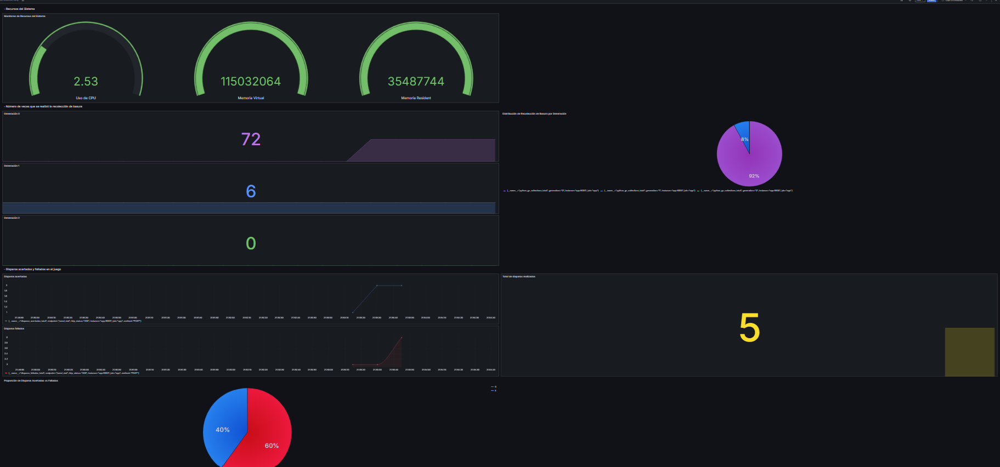

# Examen parcial CC3S2

# Juego de batalla naval
---

## Estructura del Proyecto

El proyecto está organizado de la siguiente manera:

```
.
├── Juego-Offline
│   ├── Dockerfile
│   ├── app_dockerfile
│   │   └── Dockerfile
│   ├── docker-compose.yml
│   ├── features
│   │   ├── disparar.feature
│   │   ├── environment.py
│   │   ├── jugar.feature
│   │   └── steps
│   │       ├── __pycache__
│   │       │   ├── test_disparar_steps.cpython-310-pytest-8.3.3.pyc
│   │       │   └── test_jugar_steps.cpython-310-pytest-8.3.3.pyc
│   │       ├── test_disparar_steps.py
│   │       └── test_jugar_steps.py
│   ├── grafana
│   │   ├── dashboards
│   │   │   └── SimulatorExportedExternally-1727713550400.json
│   │   └── provisioning
│   │       ├── dashboards
│   │       │   └── dashboards.yml
│   │       └── datasources
│   │           └── datasources.yml
│   ├── prometheus.yml
│   ├── requirements.txt
│   ├── src
│   │   ├── __pycache__
│   │   │   ├── app.cpython-310.pyc
│   │   │   └── batalla.cpython-310.pyc
│   │   ├── app.py
│   │   └── batalla.py
│   └── tests
│       ├── __pycache__
│       │   ├── test_app.cpython-310-pytest-8.3.3.pyc
│       │   └── test_batalla.cpython-310-pytest-8.3.3.pyc
│       ├── test_app.py
│       └── test_batalla.py
├── Multijugador
│   ├── Dockerfile
│   ├── __pycache__
│   │   ├── app.cpython-310.pyc
│   │   └── app.cpython-312.pyc
│   ├── app.py
│   ├── docker-compose.yml
│   ├── requirements.txt
│   └── src
│       ├── __pycache__
│       │   ├── socketio_server.cpython-310.pyc
│       │   └── socketio_server.cpython-312.pyc
│       ├── controllers
│       │   ├── __pycache__
│       │   │   └── game_controller.cpython-310.pyc
│       │   └── game_controller.py
│       ├── models
│       │   ├── __pycache__
│       │   │   ├── board.cpython-312.pyc
│       │   │   └── game.cpython-312.pyc
│       │   └── board.py
│       ├── socketio_server.py
│       ├── static
│       │   ├── script.js
│       │   └── style.css
│       ├── templates
│       │   ├── gameRoom.html
│       │   └── index.html
│       └── tests
│           ├── test_board.py
│           └── test_game.py
├── README.md
└── imagenes
```

## Prerrequisitos

Para poder ejecutar el proyecto, asegúrate de tener instalado lo siguiente:

- **Python 3.12**
- **Docker**
- **Docker Compose**

## Instrucciones para la Ejecución

### Paso 1: Configurar y Ejecutar Docker Compose

Primero, navega al directorio `Juego-Offline` para construir y levantar los contenedores con Docker Compose:

```bash
cd Juego-Offline
docker compose up --build -d
```

Este comando construirá las imágenes y levantará los contenedores en segundo plano.

### Paso 2: Ingresar al Contenedor de `Juego-Offline`

Una vez que los contenedores estén levantados, puedes ingresar al contenedor que contiene el juego ejecutando:

```bash
docker exec -it juego-offline-batalla-1 bash
```

### Paso 3: Ejecutar el Juego

Dentro del contenedor, puedes iniciar el juego con el siguiente comando:

```bash
python3 batalla.py
```

### Menú del Juego

Cuando ejecutes el comando anterior, verás el siguiente menú en la consola:

```
1. Jugar
2. Salir
Elige:
```

Selecciona la opción `1` para iniciar el juego o `2` para salir.

---

### Notas Adicionales

1. **Ejecutar Pruebas Unitarias (`pytest`):**
   
   Para ejecutar las pruebas unitarias en `Juego-Offline`, usa el siguiente comando desde el directorio `Juego-Offline`:

   ```bash
   pytest tests/
   ```

2. **Ejecutar Pruebas BDD (`behave`):**
   
   Para correr las pruebas de comportamiento, también desde el directorio `Juego-Offline`:

   ```bash
   behave
   ```

3. **Auditoría de Seguridad (`pip-audit`):**
   
   Puedes realizar una auditoría de seguridad para verificar posibles vulnerabilidades ejecutando:

   ```bash
   pip-audit
   ```

---


>En el juego de batalla naval, cada jugador tiene un tablero en el que se colocan barcos de diferentes tamaños, y el objetivo es hundir todos los barcos del oponente antes de quedarse sin disparos. Al iniciar, ambos jugadores configuran sus barcos y se les asignan 10 disparos iniciales. Durante el turno de un jugador, el juego muestra el tablero del oponente, ocultando la ubicación de los barcos. El jugador debe ingresar una letra para la fila y un número para la columna, indicando la posición en la que desea disparar. El resultado del disparo se muestra inmediatamente: si es acertado, se marca con un asterisco (*), y si es fallado, se muestra un guion (-). Los turnos se alternan entre jugadores hasta que uno logra hundir todos los barcos del oponente o se queda sin disparos. El juego termina anunciando al ganador.

---

**Lógica del Juego de Batalla Naval y Registro de Métricas**


>Implementamos el código en `batalla.py` para gestionar la lógica principal de un juego de batalla naval. Aquí definimos funciones para inicializar y configurar el tablero, colocar barcos de distintos tipos, y gestionar los turnos de los jugadores. También incluimos la lógica para disparar a las posiciones del tablero, determinando si los disparos son acertados o fallidos y actualizando el estado del juego en consecuencia. Además, integramos un sistema para registrar métricas de los disparos realizados, enviando esta información a un servidor para el monitoreo. Esto permite llevar un control preciso del juego y visualizar las estadísticas mediante herramientas de monitoreo como Prometheus y Grafana, lo que facilita el análisis de las partidas en tiempo real.

**API para Registro de Disparos y Exposición de Métricas con Prometheus**


>Implementamos el código en `app.py` para crear un servidor Flask que se encarga de manejar las métricas del juego de batalla naval. Este servidor registra y monitorea los disparos realizados durante las partidas, diferenciando entre aciertos y fallos. Para lograrlo, utilizamos contadores de Prometheus que se actualizan cada vez que se envía una solicitud para registrar un disparo. Los contadores permiten acumular datos sobre el total de disparos, aciertos y fallos, etiquetados según el método HTTP, el endpoint y el código de estado. Además, el servidor expone un endpoint `/metrics` que Prometheus consulta periódicamente para recolectar las métricas, facilitando el monitoreo y análisis a través de Grafana.

**Configuración de Servicios y Monitoreo con Docker Compose**


Implementamos el archivo `docker-compose.yml` para orquestar múltiples servicios que conforman el entorno de monitoreo y ejecución del juego de batalla naval.

1. **Batalla**: Es el servicio que ejecuta la aplicación principal del juego. Este contenedor está configurado para interactuar con la consola y utiliza variables de entorno para asegurar una salida de terminal sin buffering.

2. **App**: Este servicio es responsable de registrar y manejar las métricas de los disparos. Se expone en el puerto 5000 y utiliza un Dockerfile específico para construir la aplicación Flask que recopila las estadísticas de juego.

3. **Prometheus**: Configuramos este servicio para recolectar métricas del juego y de la aplicación. Utiliza una configuración personalizada (`prometheus.yml`) y expone su interfaz en el puerto 9090. Prometheus extrae datos de las métricas expuestas por el servicio `app`.

4. **Grafana**: Este servicio se encarga de visualizar las métricas recolectadas por Prometheus. Expuesto en el puerto 3001, Grafana permite crear dashboards interactivos y se configura para depender de Prometheus, asegurando que el servicio de monitoreo esté disponible antes de iniciar.

Todos los servicios están conectados a una red de tipo `bridge` llamada `monitoring` para facilitar la comunicación interna, y se utiliza un volumen para persistir los datos de Grafana, garantizando que las configuraciones se mantengan después de reiniciar los contenedores.

**Ramas Individuales y Desarrollo Colaborativo**

> Se decidió crear ramas para cada integrante, diferenciándose por: (feature/<nombre>) dependiendo de quién esté usando dicha rama.


> Utilizamos `develop` para integrar las funcionalidades antes de fusionarlas a `main` o `master`.


**Kanban, Backlog de Producto y Asignación de Tareas Justa**

## **Sprint 1:**


> Asignamos 3 historias del Backlog como parte de nuestro primer Sprint en donde Adrián se encargará del desarrollo del sistema de ataques y detección de impactos, Jared de la implementación de la colocación de barcos y gestión del tablero, y Eric se encargará de la gestión de puntuaciones y seguimiento de barcos hundidos.


> Luego pasamos a progresar en nuestras historias de usuario respectivas a este sprint, reflejándose al estar en la columna "in progress".


> Algunas historias que estaban en la columna "in progress" pasaron a "in review" para ser analizadas por todo el equipo, mientras que otras aún se encontraban en "in progress". 


> Se completó una de las revisiones de las historias y pasó a la columna "Done", mientras que una historia pasó de "in progress" a "in review".



> Se revisaron las historias restantes que estaban en "in review" y se aceptaron para pasar a la columna "Done".

## **Sprint 2:**


> En este sprint se asignaron las tareas de desarrollo de pruebas automatizadas con Behave a Jared, conexión con la base de datos Prometheus a Eric y la interfaz de monitoreo en tiempo real usando Grafana a Adrián.


> Se empezó a trabajar en las historias que se encuentran en la columna "in progress".


> La historia de conexión con la base de datos de Prometheus pasó a la columna "in review" para ser revisada por el equipo.


> La historia que estaba en la columna "in review" pasó a "Done" y todas las historias que se encontraban en "in progress" pasaron a la columna "in review".


> Se completó la revisión de las historias restantes y pasaron a la columna "Done".

## **Sprint 3:**


> Para este sprint se asignó la tarea de configurar el CI/CD Pipeline para GitHub Actions a Eric, configuración de Docker Compose a Jared, crear y ejecutar pruebas unitarias a Jared, y la clausura del sprint y preparación de la documentación final a todos los integrantes.



> Tres de las cuatro historias pasaron a la columna "in progress".


> Dos historias pasaron de la columna "in progress" a "in review".


> Una historia pasó de la columna "backlog" a la columna "in progress", las que se encontraban en la columna "in review" pasaron a "Done" y la última historia encontrada en la columna "in progress" pasó a "in review".


> Todas las historias pasaron de la columna "in review" a la columna "Done" y las que se encontraban en la columna "in progress" ahora se encuentran en la columna "in review".


> La historia faltante en la columna "in review" fue revisada por el equipo y pasó a la columna "Done".

**Configuración del Burndown Chart:**


> En este gráfico se muestra cuál fue la contribución de cada estudiante en el primer sprint de forma general.


> En este gráfico se muestra cuál fue la contribución de cada estudiante en el primer sprint, específicamente en la columna "Done".


> En este gráfico se puede visualizar el progreso de cada estudiante en el segundo sprint.


> En este gráfico se puede visualizar el progreso de cada estudiante en el tercer sprint.

**GitHub actions y CI/CD**


>Este flujo de trabajo de GitHub Actions automatiza la integración y entrega continua (CI/CD) para el proyecto. Se activa en las ramas principales de desarrollo y características, instalando dependencias, realizando auditorías de seguridad, ejecutando pruebas unitarias y de comportamiento, y desplegando contenedores con Docker Compose. Esto asegura la calidad del código y la correcta integración de nuevas funcionalidades en el proyecto.

**Pruebas y BDD**

- Pruebas Unitarias


1. **Funciones Importadas y Utilizadas:**
   - Importa funciones y constantes relacionadas con la lógica del juego desde el módulo `batalla`, permitiendo configurar el entorno de prueba.

2. **Pruebas Implementadas:**
   - **`test_es_mar()`:** Verifica si una celda en la matriz es considerada "mar" o no, comprobando el comportamiento de la función `es_mar`.
   - **`test_disparar_acierto()`:** Prueba la función `disparar_para_pruebas` para asegurar que un disparo a una posición con un barco resulte en un acierto.
   - **`test_disparar_fallo()`:** Prueba la misma función para un disparo que no acierta a ningún barco, registrando un fallo.
   - **`test_colocar_barcos()`:** Valida que la función para colocar barcos distribuya correctamente los barcos en la matriz de juego, contando la cantidad esperada de barcos después de la colocación.


- Pruebas de Integración


1. **Configuración del Cliente de Prueba:** Se utiliza un cliente de pruebas para simular solicitudes HTTP a la aplicación, permitiendo la verificación de rutas sin ejecutar el servidor completo.

2. **Verificación de Rutas:**
   - **`/metrics`:** Se asegura de que la ruta de métricas devuelva el contenido correcto y un estado `200`.
   - **`/send_stat`:** Se prueban solicitudes `POST` para registrar disparos acertados y fallidos, confirmando que el servidor los maneje adecuadamente.

- Pruebas Automatizadas con Behave



 **Archivo `test_disparar_steps.py`**
   - Define los pasos de los escenarios de disparo:
     - **Funciones `given`:** Configuran la matriz del juego con o sin barcos según lo requerido por el escenario.
     - **Funciones `when`:** Simulan un disparo a una posición específica en la matriz.
     - **Funciones `then`:** Verifican si el resultado del disparo fue acertado o fallado, comparando con el resultado esperado.


 **Archivo `test_jugar_steps.py`**
   - Define los pasos de los escenarios de juego:
     - **Funciones `given`:** Preparan la matriz del oponente y simulan la condición de todos los barcos hundidos.
     - **Funciones `when`:** Simulan acciones del jugador, como disparar a una posición o alcanzar una condición de victoria.
     - **Funciones `then`:** Verifican si el disparo fue un acierto y si el juego termina correctamente bajo las condiciones probadas.


 **Archivo `disparar.feature`**
   - **Escenario: Disparo acertado**
     - Prueba que al disparar a una posición donde hay un barco, el disparo sea registrado como un acierto.
   - **Escenario: Disparo fallado**
     - Verifica que al disparar a una posición sin barco, el disparo sea considerado un fallo.


 **Archivo `jugar.feature`**
   - **Escenario: Turno del jugador 1 acertado**
     - Valida que si el jugador 1 dispara a una posición con un barco en la matriz del oponente, el disparo sea acertado.
   - **Escenario: Fin del juego**
     - Comprueba que cuando todos los barcos han sido hundidos, el juego termine indicando la victoria del jugador.


 **Archivo `environment.py`**
   - Configura el contexto antes de cada escenario, inicializando la matriz del juego mediante la función `obtener_matriz_inicial`. Esto asegura que cada escenario de prueba comience con una matriz limpia y consistente.


**Monitoreo con Grafana y Prometheus**


 **Prometheus**:
   - Prometheus está configurado para recolectar métricas de la aplicación del juego de batalla naval. La aplicación expone sus métricas en el endpoint `http://localhost:5000/metrics`. 
   - Prometheus, que se ejecuta en el puerto `9090`, se conecta periódicamente a este endpoint para recopilar datos sobre el rendimiento y el estado de la aplicación, como la cantidad de disparos realizados, aciertos y fallos, uso de recursos, entre otros.
   - Estos datos se almacenan en la base de datos interna de Prometheus para ser utilizados en la visualización.


 **Flujo de Monitorización**:
   - La aplicación del juego envía continuamente métricas al endpoint `/metrics`.
   - Prometheus, corriendo en `9090`, recolecta estos datos a intervalos definidos.
   - Grafana, accediendo a los datos en Prometheus desde el puerto `3001`, permite la visualización detallada y personalizable de estas métricas.




 **Grafana**:
   - Grafana está desplegado en el puerto `3001` y se conecta a Prometheus como su fuente de datos principal. 
   - Con los datos recolectados por Prometheus, Grafana permite crear dashboards que muestran gráficamente la información del sistema, como gráficos de rendimiento, estadísticas de juego y cualquier otra métrica relevante.
   - Esto facilita el monitoreo en tiempo real, permitiendo a los usuarios ver el estado actual del sistema, identificar patrones de uso y posibles problemas de rendimiento.

---

**Implementación extra de Multijugador en el Juego de Batalla Naval**


>En el directorio `Multijugador`, hemos desarrollado una versión mejorada del juego para permitir la modalidad multijugador, en la que dos jugadores pueden enfrentarse en tiempo real a través de una interfaz web. Esta mejora representa un avance hacia la implementación completa de partidas multijugador, donde cada jugador puede colocar sus barcos y ver el progreso del juego en sus respectivos tableros. La interfaz actual permite la configuración inicial del juego, mostrando el tablero del jugador y el de su oponente.

Para ejecutar esta versión, se debe navegar al directorio `Multijugador` y utilizar el comando `flask run`, el cual inicia el servidor de Flask que gestiona la conexión entre los jugadores. Aunque hemos conseguido que ambos jugadores puedan colocar sus barcos y prepararse para jugar, la funcionalidad completa para llevar a cabo una partida, con turnos de disparo y notificaciones en tiempo real, aún está en desarrollo. Este es un paso importante hacia la implementación completa de un juego de batalla naval multijugador que esperamos perfeccionar en futuras versiones.


## Agradecimientos:
Agradecemos al tutorial de Luis Cabrera Benito del Blog Parzybite, de quien nos inspiramos en el código fuente del modo Offline.
### Tutorial y explicación:
https://parzibyte.me/blog/2021/12/21/batalla-naval-python-programacion-juego/
Cabe mencionar que el código fuente del juego fue modificado para que pueda enviar solicitudes de métricas al servidor y además lo unico extraido de otro proyecto de este.